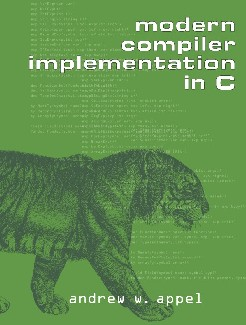

# Tiger Compiler

Tiger compiler is a compiler for the tiger language which is described in the [book](https://www.cs.princeton.edu/~appel/modern/c/). This project is an attempt to implement tiger compiler in C language.

